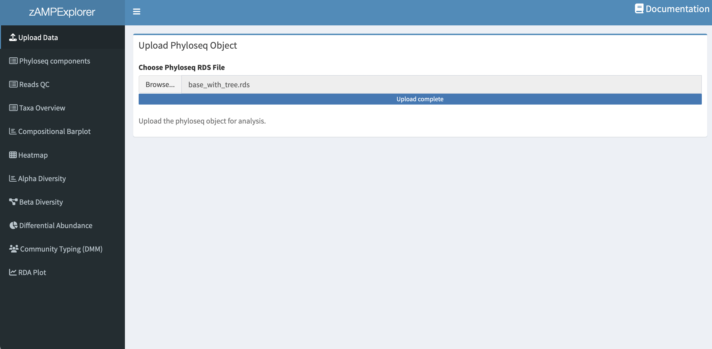
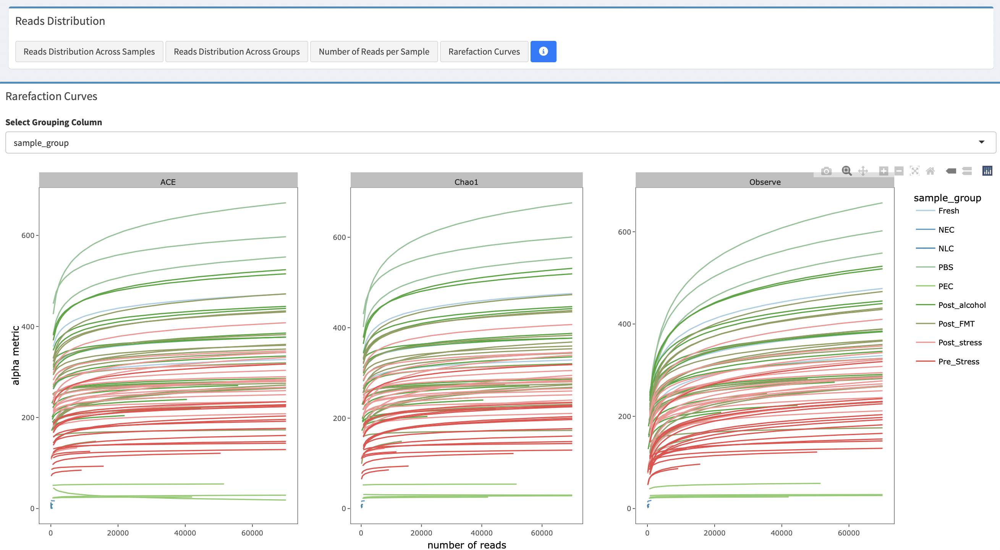

# zAMPExplorer
zAMPExplorer is an interactive Shiny application designed to facilitate the downstream analysis of outputs generated by the [zAMP pipeline](https://zamp.readthedocs.io/en/latest/) . zAMP itself is a comprehensive DADA2-based bioinformatics pipeline for processing 16S rRNA gene amplicon metagenomic sequences, offering convenient, reproducible, and scalable analysis from raw sequencing reads to taxonomic profiles. The output of zAMP is a phyloseq object, which serves as the input for zAMPExplorer.

A typical `phyloseq` object contains the following components:

```r
## phyloseq-class experiment-level object
## otu_table()   OTU Table:         [ 5 taxa and 6 samples ]
## sample_data() Sample Data:       [ 6 samples by 4 sample variables ]
## tax_table()   Taxonomy Table:    [ 5 taxa by 7 taxonomic ranks ]
## phy_tree()    Phylogenetic Tree: [ 5 tips and 4 internal nodes ]
## refseq()      DNAStringSet:      [ 5 reference sequences ]
```

For more information on the [phyloseq package](https://rdrr.io/bioc/phyloseq/man/phyloseq-package.html), please visit the official [phyloseq documentation](https://rdrr.io/bioc/phyloseq/man/phyloseq.html).


zAMPExplorer enables users to perform a wide range of microbiota and statistical analyses, including compositional barplot, relative abundance heatmap, community diversity (alpha diversity), community similarity through unsupervised (NMDS/PCoA) and supervised (RDA) ordinations, differential abundance testing using MaAsLin, and community typing (or clustering) of microbial profiles using Dirichlet Multinomial Mixtures (DMM). All of these analyses are made accessible through an intuitive graphical interface, bridging the gap between complex command-line bioinformatics processing and user-friendly data exploration.


## Prerequisites and installation

### Prerequisites

- **Operating system**: Windows, macOS, or Linux
- **R**: Version 4.3.2 or later
- **RStudio**: Recommended for running the Shiny app
- **zAMP**: zAMPExplorer is designed to work with output generated from the zAMP pipeline (phyloseq object).

## Installation

### Method 1: Using R-universe

   ```r
   install.packages('zAMPExplorer', repos = c('https://metagenlab.r-universe.dev', 'https://cloud.r-project.org'))
   ```
   
### Method 2: Install from Source (GitHub)

```r
install.packages("devtools") # If not already installed
```

```r
devtools::install_github("https://github.com/metagenlab/zAMPExplorer")
```

### Method 3: Install from a Local File

1. **Download .tar.gz file from GitHub.**
2. **Install package:**

```r
install.packages("path/to/zAMPExplorer_0.1.0.tar.gz", repos = NULL, type = "source")
```

##  Launch the Application:
After installation, you can launch the app with:

```r
library(zAMPExplorer)
zAMPExplorer_app()
```

## Overview of the interface

zAMPExplorer is divided into several tabs, each dedicated to a specific type of analysis:



- **Check Phyloseq Components**: Upload your `phyloseq` object here. This object is the output of the zAMP pipeline and serves as the input for all downstream analyses in the app.

  
  
- **Reads QC**: Visualize the total number of reads per sample and the estimated number of organisms in each sample at different taxonomic levels.

 

 - **Taxa Overview**: Visualize the total number of reads per sample and the estimated number of organisms in each sample at different taxonomic levels.

 
 
- **Compositional Barplot**: Create interactive barplots to visualize the relative abundance of taxa within your samples.

  
  
- **Heatmap**: Generate heatmaps to visualize the relative abundance of taxa across samples and sample groups.
- **Alpha Diversity**: Analyze and visualize alpha diversity metrics, comparing diversity within groups.

  
  
- **Beta Diversity**: Explore beta diversity using different distance matrices to assess similarities/differences in microbial communities between samples.
- **Differential abundance testing (MAaslin2)**: Determining associations between microbial features (e.g., taxa) and metadata.

  

- **Community Typing (DMM)**: Perform community typing using Dirichlet Multinomial Mixture models to infer the optimal number of community types inside the dataset.

  

- **RDA Plot**: Perform redundancy analysis (RDA) to explore the association between your samples and explanatory variables.


## Troubleshooting and FAQ

### Common issues

- **Issue**: App fails to launch.
  - **Solution**: Ensure all dependencies are installed by running `source("Dependencies.R")`.

- **Issue**: Plots are not displaying correctly.
  - **Solution**: Verify your R version is 4.0 or later and that all necessary libraries are installed.

### FAQ

- **Q**: What file types can I upload?
  - **A**: zAMPExplorer supports `.rds` files containing `phyloseq` objects.

- **Q**: How do I update the app with new features?
  - **A**: Pull the latest updates from the GitHub repository, or fork the project and make changes to your fork.


## References

The following R packages are integral to the functionality of zAMP Explorer. We highly recommend consulting their respective documentation:

- **shiny**: [Shiny Web Application Framework for R](https://CRAN.R-project.org/package=shiny)
- **shinydashboard**: [Create Dashboards with 'Shiny'](https://CRAN.R-project.org/package=shinydashboard)
- **hinyWidgets**: [Custom Inputs Widgets for Shiny](https://github.com/dreamRs/shinyWidgets)
- **webshot2**: [Taking Screenshots of Web Pages](https://CRAN.R-project.org/package=webshot2)
- **htmlwidgets**: [HTML Widgets for R](https://github.com/ramnathv/htmlwidgets)
- **dplyr**: [A grammar of data manipulation](https://dplyr.tidyverse.org)
- **phyloseq**: [Handling and Analysis of High-Throughput Microbial Community Data](https://rdrr.io/bioc/phyloseq/)
- **DT**: [An R interface to the JavaScript library DataTables](https://cran.r-project.org/web/packages/DT/index.html)
- **ggplot2**: [Create Elegant Data Visualisations Using the Grammar of Graphics](https://ggplot2.tidyverse.org/)
- **ggpubr**: [ggpubr: ‘ggplot2’ Based Publication Ready Plots](https://rpkgs.datanovia.com/ggpubr/)
- **plotly**: [Create Interactive Web Graphics via 'plotly.js'](https://CRAN.R-project.org/package=plotly)
- **vegan**: [vegan: an R package for community ecologists](https://github.com/vegandevs/vegan)
- **RColorBrewer**: [ColorBrewer Palettes](https://renenyffenegger.ch/notes/development/languages/R/packages/RColorBrewer/index)
- **ComplexHeatmap**: [Make Complex Heatmaps](https://bioconductor.org/packages/release/bioc/html/ComplexHeatmap.html)
- **InteractiveComplexHeatmap**: [Make Interactive Complex Heatmaps in R](https://academic.oup.com/bioinformatics/article/38/5/1460/6448211?login=false)
- **vegan**: [Community Ecology Package](https://CRAN.R-project.org/package=vegan)
- **microViz**: [Tools to make microbial community data more accessible](https://github.com/david-barnett/microViz)
- **microbiome**: [Microbiome Analytics](https://microbiome.github.io/tutorials/)
- **MicEco**: [Various functions for analysis for microbial community data](https://github.com/Russel88/MicEco)
- **metagMisc**: [Miscellaneous functions for metabarcoding and metagenomic analysis](https://github.com/vmikk/metagMisc)
- **mia**: [mia - Microbiome analysis](https://microbiome.github.io/mia/)
- **DirichletMultinomial**: [Dirichlet-Multinomial Mixture Model Machine Learning for Microbiome Data](https://bioconductor.org/packages/release/bioc/html/DirichletMultinomial.html)

For detailed information about each package, visit the provided links.


## Contributing
Thank you for using zAMPExplorer. We hope it helps you gain deeper insights into your microbiome data (16S amplicons). Please feel free to contribute, suggest features, or report any issues you encounter.


## Acknowledgments
We would like to thank the developers of the R packages and tools integrated into zAMPExplorer. Please make sure to acknowledge their contributions in any publications or projects using this tool.


